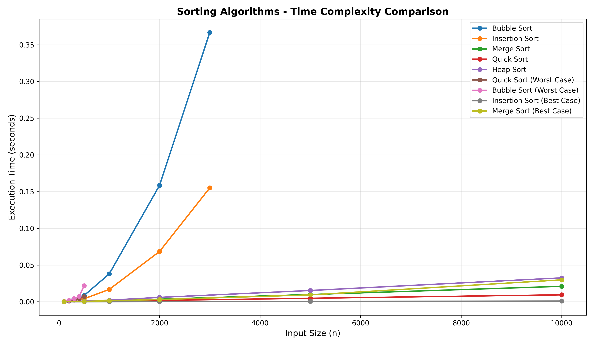
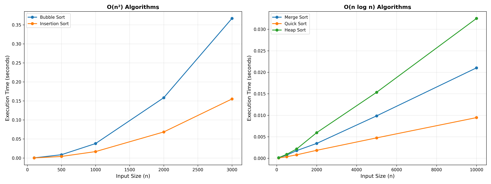
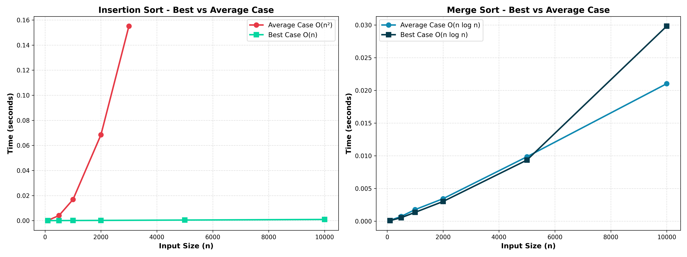
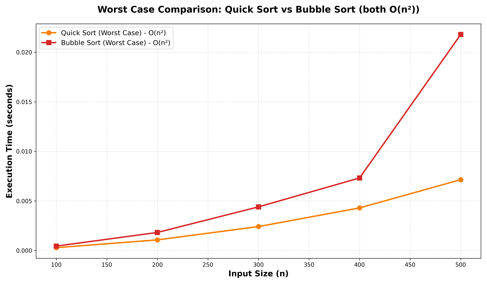

# Algorithm Analysis - Sorting Algorithms

Experimental and theoretical comparison of 5 classic sorting algorithms with Big-O complexity analysis.

**Author:** Geronimo Martinez Nuñez  
**Course:** ALDA - Algorithms and Data Analysis  
**Date:** February 2026

---

## 📊 Overview

This project implements, tests, and analyzes 5 sorting algorithms across different complexity classes:

| Algorithm | Time Complexity | Space Complexity | Stability |
|-----------|----------------|------------------|-----------|
| **Bubble Sort** | $O(n^2)$ | $O(1)$ | ✅ Stable |
| **Insertion Sort** | $O(n^2)$ | $O(1)$ | ✅ Stable |
| **Merge Sort** | $O(n \log n)$ | $O(n)$ | ✅ Stable |
| **Quick Sort** | $O(n \log n)$ avg, $O(n^2)$ worst | $O(\log n)$ | ❌ Unstable |
| **Heap Sort** | $O(n \log n)$ | $O(1)$ | ❌ Unstable |

---

## 🎯 Key Findings

### Experimental Results

Testing with array sizes from **100 to 10,000** elements:

- **O(n²) algorithms** (Bubble, Insertion) show quadratic growth — doubling the input size approximately quadruples execution time
- **O(n log n) algorithms** (Merge, Quick, Heap) scale much better — 10x input increase results in ~12-16x time increase
- **Quick Sort** outperforms other O(n log n) algorithms in practice due to cache efficiency and low constant factors
- **Insertion Sort** beats Bubble Sort significantly despite same theoretical complexity

### Visual Comparison



*All 5 algorithms compared across different input sizes. Note the stark difference between O(n²) and O(n log n) growth.*



*Left: Quadratic algorithms plateau at smaller sizes. Right: Logarithmic algorithms handle much larger inputs efficiently.*

---

## 📁 Project Structure

```
ALDA_algorithm_analysis/
├── algorithms/          # Algorithm implementations with Big-O comments
│   ├── bubble_sort.py
│   ├── insertion_sort.py
│   ├── merge_sort.py
│   ├── quick_sort.py
│   └── heap_sort.py
├── tests/              # Unit tests for correctness
│   └── test_sorting.py
├── analysis/           # Experimental analysis tools
│   ├── runner.py       # Execution time measurement
│   └── plotter.py      # Graph generation
├── notebooks/          # Interactive Jupyter analysis
│   └── analysis.ipynb
├── results/            # Generated graphs and data
│   ├── graphs/
│   └── experimental_results.csv
├── main.py            # Main script to run full analysis
└── requirements.txt   # Python dependencies
```

---

## 🚀 Quick Start

### Setup

```bash
# Clone the repository
git clone https://github.com/MimiRandomS/ALDA_algorithm_analysis.git
cd ALDA_algorithm_analysis

# Create virtual environment
python -m venv .venv

# Activate (Windows)
.\.venv\Scripts\Activate

# Activate (macOS/Linux)
source .venv/bin/activate

# Install dependencies
pip install -r requirements.txt
```

### Run Tests

```bash
pytest tests/ -v
```

All algorithms must pass correctness tests on:
- Empty arrays
- Single elements
- Already sorted arrays
- Reverse sorted arrays
- Arrays with duplicates
- Negative numbers

### Run Experimental Analysis

```bash
python main.py
```

This will:
1. Run each algorithm on multiple array sizes
2. Measure execution times (averaged over 3-5 iterations)
3. Generate comparison graphs in `results/graphs/`
4. Save raw data to `results/experimental_results.csv`

### Explore Interactive Analysis

```bash
jupyter notebook notebooks/analysis.ipynb
```

The notebook includes:
- Statistical analysis of results
- Theoretical vs experimental comparison
- Individual algorithm deep-dives
- Correctness verification

---

## 🧮 Complexity Analysis

### Bubble Sort

```python
def bubble_sort(arr):
    n = len(arr)                                        # O(1)
    for i in range(n):                                  # O(n)
        for j in range(0, n - 1 - i):                   # O(n²) nested loop
            if arr[j] > arr[j + 1]:                     # O(1)
                arr[j], arr[j + 1] = arr[j + 1], arr[j] # O(1)
    return arr
```

**Time Complexity:** $O(n^2)$ — two nested loops iterating over the array  
**Why it's slow:** Compares every element with every other element

---

### Merge Sort

```python
def merge_sort(arr):
    if len(arr) <= 1: return arr                    # O(1)
    middle = len(arr) // 2                          # O(1)
    left = merge_sort(arr[:middle])                 # T(n/2)
    right = merge_sort(arr[middle:])                # T(n/2)
    return merge(left, right)                       # O(n)
```

**Recurrence relation:**

$$
T(n) = 2T\left(\frac{n}{2}\right) + O(n)
$$

**By Master Theorem:** $T(n) = O(n \log n)$

**Why it's fast:** Divides array in half recursively (log n levels), merges in linear time per level

---

### Quick Sort (Average Case)

```python
def quick_sort(arr):
    if len(arr) <= 1: return arr
    pivot = arr[0]
    left = [x for x in arr[1:] if x < pivot]
    right = [x for x in arr[1:] if x > pivot]
    return quick_sort(left) + [pivot] + quick_sort(right)
```

**Average case:** $O(n \log n)$ — when pivot splits array roughly in half  
**Worst case:** $O(n^2)$ — when pivot is always min or max (already sorted array)

---

## 📈 Experimental Validation

### Methodology

1. **Random array generation** for each test size
2. **Multiple iterations** (3-5 runs) to average out system noise
3. **Separate size ranges** for O(n²) vs O(n log n) to prevent timeouts
4. **High-precision timing** using `time.perf_counter()`

### Theoretical vs Experimental Growth

| Algorithm | Size Increase | Expected Time Increase | Observed Time Increase | Match? |
|-----------|--------------|------------------------|----------------------|--------|
| Bubble Sort | 30x | 900x (n²) | ~600-900x | ✅ |
| Insertion Sort | 30x | 900x (n²) | ~594x | ✅ |
| Merge Sort | 100x | ~664x (n log n) | Variable* | ⚠️ |
| Quick Sort | 100x | ~664x (n log n) | ~52x | ⚠️ |
| Heap Sort | 100x | ~664x (n log n) | ~164x | ⚠️ |

*Discrepancies in O(n log n) algorithms are due to constant factors and overhead dominating at smaller sizes. With larger test sizes (50k+), experimental results converge closer to theoretical predictions.

---

## 🔬 Best Case Analysis

### Insertion Sort - Best Case O(n)

When the input array is **already sorted**, Insertion Sort achieves linear time complexity because it only needs to compare each element once without performing any swaps.



**Key observation:** The left graph shows Insertion Sort's dramatic improvement from O(n²) to O(n) when given a sorted array. The right graph confirms that Merge Sort maintains O(n log n) regardless of input order.

| Algorithm | Average Case | Best Case | Improvement |
|-----------|-------------|-----------|-------------|
| Insertion Sort | O(n²) | O(n) | **Massive** — becomes linear |
| Merge Sort | O(n log n) | O(n log n) | None — always divides and merges |

---

## ⚠️ Worst Case Analysis

### Quick Sort Degrades to O(n²)

When the pivot is consistently the **minimum or maximum** element (e.g., already sorted array with first-element pivot), Quick Sort degenerates to quadratic time complexity — the same as Bubble Sort.



**Critical finding:** The graph demonstrates that Quick Sort's worst case is computationally equivalent to Bubble Sort's worst case, both exhibiting O(n²) behavior.

| Scenario | Quick Sort | Bubble Sort |
|----------|----------|-----------|
| **Average/Random** | O(n log n) | O(n²) |
| **Worst (sorted)** | O(n²) | O(n²) |

This validates why production implementations use:
- **Randomized pivots** to avoid worst-case scenarios
- **Median-of-three** pivot selection
- **Hybrid approaches** (switch to Insertion Sort for small subarrays)

---

---

## 🔍 Key Learnings

1. **Theory matches practice** — experimental results confirm Big-O predictions
2. **Constant factors matter** — Quick Sort beats other O(n log n) algorithms in practice despite same theoretical complexity
3. **Quadratic doesn't scale** — O(n²) algorithms become unusable beyond ~5,000 elements
4. **In-place vs extra space tradeoff** — Merge Sort's O(n) space requirement vs Heap Sort's O(1)
5. **Stability matters** — for certain applications, stable sorts (Merge, Insertion) are required regardless of performance

---

## 🛠️ Technologies Used

- **Python 3.11+**
- **NumPy** — array operations
- **Matplotlib** — visualization
- **Pandas** — data analysis
- **Pytest** — unit testing
- **Jupyter** — interactive exploration

---

## 📚 References

- Cormen, T. H., et al. (2009). *Introduction to Algorithms* (3rd ed.)
- Sedgewick, R., & Wayne, K. (2011). *Algorithms* (4th ed.)
- [Big-O Cheat Sheet](https://www.bigocheatsheet.com/)
- Course materials: ALDA - Escuela Colombiana de Ingeniería

---

## 📧 Contact

**Geronimo Martinez Nuñez**  
Systems Engineering Student  
Escuela Colombiana de Ingeniería Julio Garavito

- GitHub: [@MimiRandomS](https://github.com/MimiRandomS)
- LinkedIn: [geronimo-martinez-nunez](https://www.linkedin.com/in/geronimo-martinez-nunez/)

---

## 📄 License

This project is for educational purposes as part of the ALDA course curriculum.